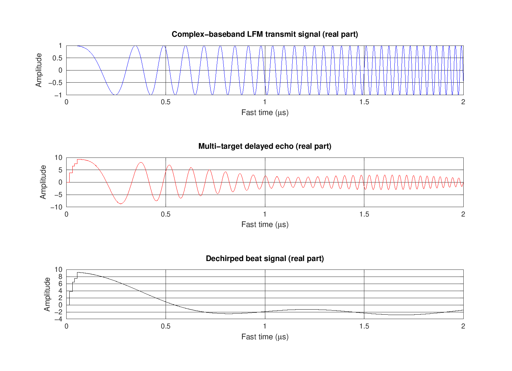
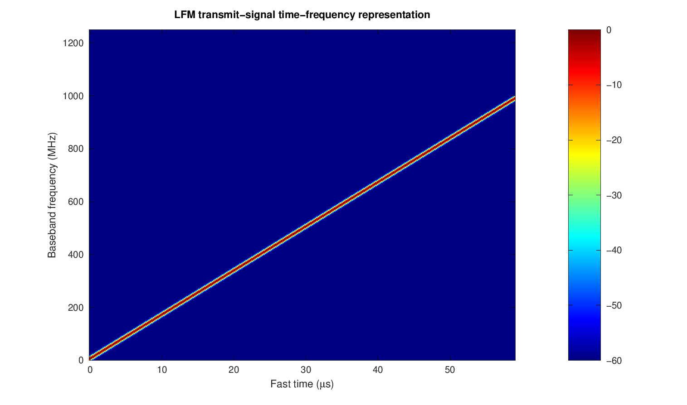
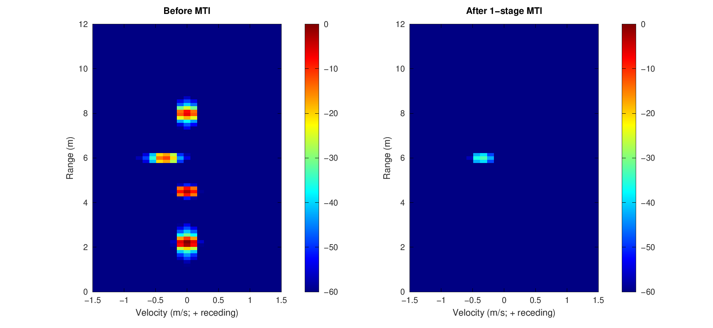
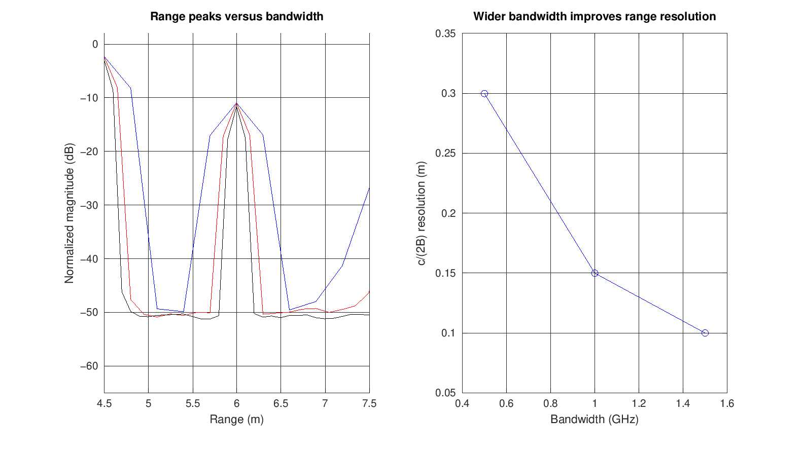
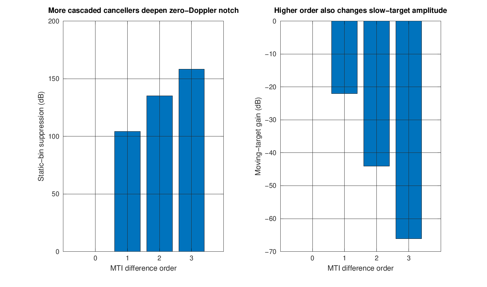
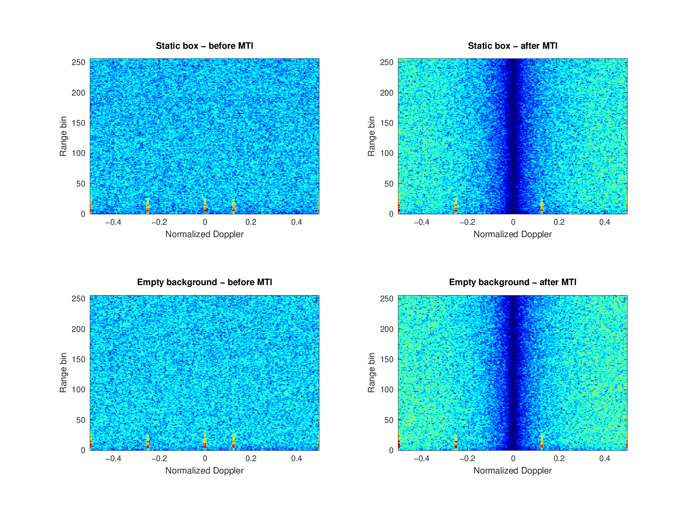
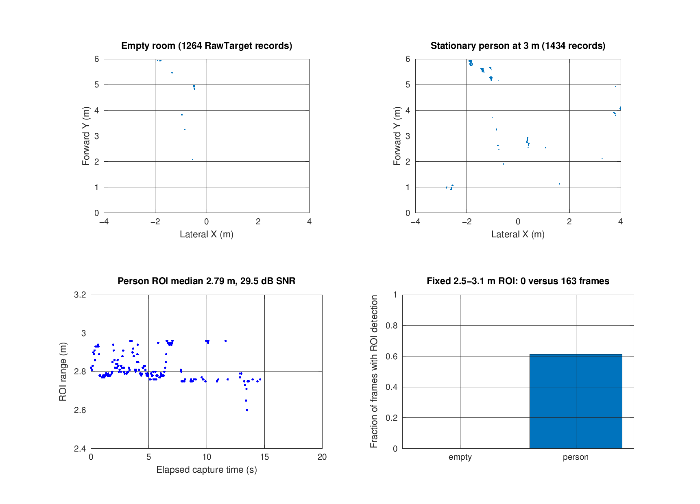
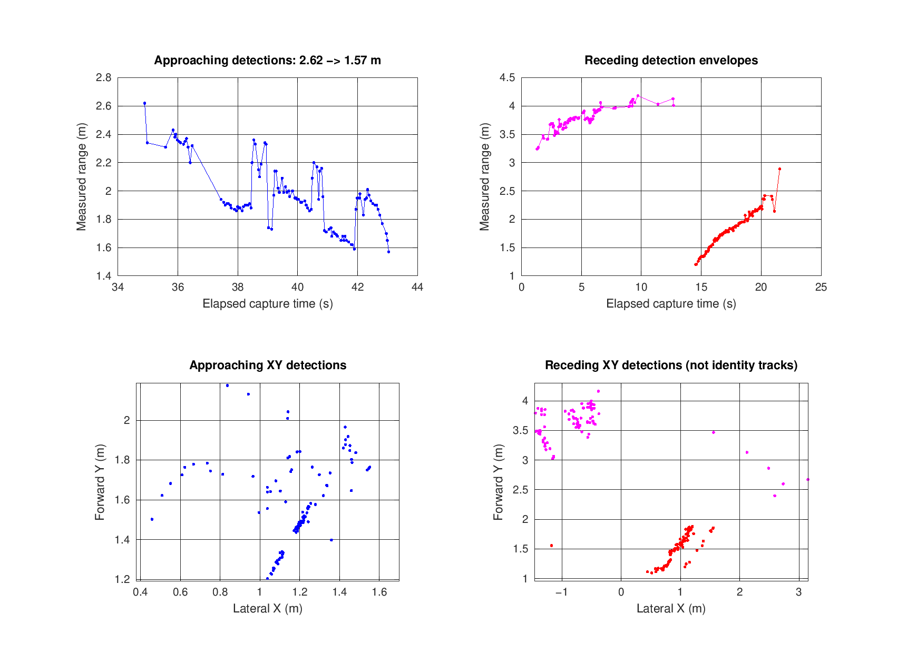

# 从教学 LFMCW 到真实室内杂波：CTSAI-A100 低速目标与 MTI 实验

## 摘要

室内低速目标检测的难点不是“做一次 FFT”本身，而是如何区分三个层次：标准 LFMCW 理论、硬件输出的真实数据，以及我们有证据支持的物理解释。本案例在室内房间使用 CTSAI-A100 采集空场、静止塑料目标、小推车/箱子靠近与远离、约 3 米静止人员和人员短距离远离数据；同时在 GNU Octave 11.3.0 中建立一个参数完全已知的 LFMCW 教学仿真，展示发射信号、回波、差频、时频图、距离 FFT、距离—多普勒 2D-FFT 和 MTI。

项目坚持一条边界：教学仿真是合成信号，实测文件是真实雷达记录，两者不能混为一谈。A100 ADC 文本没有同时提供完整可核验的调频斜率、采样率、chirp 时序、DDMA 相位编码和通道标定，所以实测 ADC 只在 bin 域分析；目标物理距离和运动方向由 RadarTools 的 RawTarget/TraTarget 输出补充。这样做牺牲了一些“图上直接标米每秒”的直观性，却避免了把未知硬件频点强行解释成准确速度。

全部软件均免费。核心代码为 MATLAB 兼容 `.m` 文件，实测与仿真在 GNU Octave 11.3.0 和 `signal` 1.4.7 中完成验证。

## 1. 场景与实验目标

测试环境是室内房间，可对应校园走廊、教学楼楼道或实验室门口一类空间。雷达倾斜安装，中心离地约 0.95 m，具体倾角没有测量。静止受控目标由采集者记录为塑料材质，约 1.00 m × 0.80 m。移动目标为小推车/箱子；补充测试还采集了约 3 米静止人员和人员短距离远离。

室内房间天然包含墙体、地面、门框和家具等强静态散射体。它们既是 MTI 的目标杂波，也是低速检测的主要干扰源。实验希望回答四个问题：

1. 标准 LFMCW 距离和速度处理如何工作？
2. 一阶或多阶 MTI 如何抑制零多普勒附近的静态分量？
3. 带宽、chirp 时宽、PRF、目标速度、目标数量和 MTI 阶数怎样改变结果？
4. 理想仿真和 A100 室内实测为何不同？

本项目不把“图变干净”当成检测性能证明。MTI 在压制墙面和直流分量的同时，也会衰减极慢目标和暂停目标；因此必须同时观察目标输出、运动趋势和处理边界。

## 2. 数据采集与筛选

### 2.1 ADC 数据

有效 ADC 包括：

- 静止塑料目标，Rx0–Rx3；
- 空场背景，Rx0–Rx3；
- 小推车/箱子由远到近，Rx0；
- 小推车/箱子由近到远，Rx0，使用最终 `retry3`。

每个文本文件的前三个数值依次为接收通道、1024 个快时间样本和 256 个 chirp。随后是 131072 个 32 位打包字，每个字包含两个有符号 16 位 ADC 样本。本批文件还包含一个尾部零填充。严格加载流程是：

1. 先读取并验证 `[Rx, 1024, 256]`；
2. 由文件名中的 `RxN` 交叉验证通道；
3. 计算期望打包字数 `1024×256/2=131072`；
4. 只在确认多余字段全部为零后截取；
5. 按高 16 位、低 16 位拆成有符号样本；
6. 重排为 `1024×256`。

原有官方 `load_adc_data.m` 没有正确跳过三个头字段。本提交提供聚焦修复，并由 `tests/test_upstream_loader.m` 验证。项目自己的 `load_a100_adc.m` 还覆盖错误头部、短文件和非零尾部等失败路径。

### 2.2 点云、跟踪与 CAN

RadarTools 每组目标数据包含 CAN ASC、RawTarget CSV 和 TraTarget CSV。CSV 不是普通矩形表：表头后穿插帧开始行、时间戳、状态信息和目标行。解析器只接受字段数量与表头一致且 `ObjId`、`range`、`speed`、`angle` 可解析的目标记录，同时保留帧序号和采集时间。

正式场景共有七组：

| 时间 | 场景 |
| --- | --- |
| 16:19:35 | 静止塑料目标 |
| 16:23:49 | 空场背景 |
| 16:27:16 | 小推车/箱子靠近 |
| 16:34:07 | 小推车/箱子远离 |
| 19:13:58 | 新空场 |
| 21:35:30 | 约 3 米静止人员 |
| 21:39:26 | 人员短距离远离 |

新增人员会话期间，RadarTools 显示近波模式 3、CAN-FD、CAN1、500K/2M。正确的点云保存顺序是先启动右上角 CAN `Start`，确认接收后再开启“点云采集”；结束时先停止点云保存、等待文件落盘，再停止 CAN。

采集时没有连接摄像头，因而 MP4 为 0 字节。它们不表示雷达失败，但没有提交。ADC `retry2`、连接恢复过程、目标未到位或动作不符合计划的多组记录也被排除。原始采集工作区没有被覆盖或删除。

## 3. LFMCW 教学模型

### 3.1 发射与回波

设 chirp 斜率为

\[
S=\frac{B}{T_c},
\]

其中 \(B\) 是带宽，\(T_c\) 是 chirp 时宽。忽略载频常数项后的复基带发射信号可写为

\[
s_{tx}(t)=\exp(j\pi S t^2), \quad 0\le t<T_c.
\]

距离为 \(R\)、径向速度为 \(v\) 的目标产生往返时延 \(\tau=2R/c\) 和多普勒频率 \(f_D=2v/\lambda\)。简化回波为

\[
s_{rx}(t)=A\,s_{tx}(t-\tau)\exp(j2\pi f_D t).
\]

多个目标和静止散射体的回波线性叠加，再加入复白噪声。去斜差频信号由发射参考和回波相乘得到，其主差频近似包含距离项 \(2SR/c\) 和多普勒项。

项目默认教学场景设置一个位于 6 m、速度 −0.35 m/s 的靠近小推车，以及 2.2 m、4.5 m 和 8.0 m 三个静止散射体，分别代表门框、墙面和远墙。正速度定义为远离，负速度定义为靠近。

### 3.2 距离 FFT 与 2D-FFT

对每个 chirp 的快时间采样加 Hann 窗并做 FFT，得到距离频谱。理论距离分辨率为

\[
\Delta R=\frac{c}{2B}.
\]

再沿 chirp 方向做慢时间 FFT，得到距离—多普勒矩阵。慢时间频点 \(f_D\) 可在仿真中通过已知载频换算为径向速度：

\[
v=\frac{\lambda f_D}{2}.
\]

默认参数为 77 GHz 载频、1 GHz 带宽、60 μs chirp、70 μs 重复周期、1024 个快时间样本和 256 个 chirp。它们是教学参数，不是从 A100 文件推断出的硬件配置。





## 4. MTI 静态杂波抑制

一阶脉冲对消器在慢时间执行相邻 chirp 差分：

\[
y[n]=x[n]-x[n-1].
\]

\(P\) 阶级联差分的传递函数为

\[
H(z)=(1-z^{-1})^P,
\]

其频率响应幅度与

\[
\left|2\sin\left(\pi f/\mathrm{PRF}\right)\right|^P
\]

成正比。零多普勒处出现陷波，阶数越高陷波越深，但非常慢的目标也越接近陷波中心。这个权衡是本案例参数研究的重点。

默认含噪仿真中，移动目标距离误差为 0.0042 m、速度误差为 0.0241 m/s，零速度静态分量抑制度为 76.5 dB。



## 5. 六组参数研究

参数研究每次只改变一个变量，并固定随机种子，避免同时改变多个参数后无法解释原因。

### 5.1 LFM 带宽

带宽从 0.5、1.0 到 1.5 GHz 时，理论距离分辨率分别为 0.300、0.150 和 0.100 m。更宽带宽可分开更接近的距离目标，但在给定 ADC 速率和 chirp 时宽下会提高差频并缩小采样限制的无模糊距离。



### 5.2 LFM 时宽

在保持 ADC 采样率近似不变时，将 chirp 时宽从 40 μs 增加到 80 μs，同一 6 m 目标的差频从约 1.001 MHz 降至 0.500 MHz，ADC 限制的无模糊距离从约 51.1 m 增至 102.4 m。带宽不变，所以理论距离分辨率仍为 0.1499 m。时宽还会改变可用 PRF 和速度处理，不能只看距离收益。

### 5.3 PRF

PRF 取 8、12 和 14.286 kHz 时，无模糊速度范围约为 7.79、11.68 和 13.91 m/s。固定 256 个 chirp 后，速度 bin 间隔也从 0.0608 增至 0.1086 m/s；因此更高 PRF 扩大速度范围，却使固定帧长度下的速度分辨更粗。

### 5.4 目标速度

仿真速度 −0.15、−0.35 和 −0.70 m/s 分别落在 −0.1086、−0.3259 和 −0.6518 m/s 的离散速度 bin。一次 MTI 后，目标幅度相对输入约为 −29.4、−22.0 和 −16.0 dB。越慢的目标越靠近零频陷波，损失越大。

### 5.5 目标数量

目标数由 1 增至 2 和 4 时，6 m 移动目标仍可定位在 5.996 m 附近，但更多静止散射体提高了旁瓣、峰值重叠和动态范围压力。真实房间的连续墙面和多径远比四个理想点目标复杂。

### 5.6 MTI 对消阶数

理想确定性参数实验中，0、1、2、3 阶的静态抑制度约为 0、104、135 和 158 dB，而移动目标相对幅度约为 0、−22、−44 和 −66 dB。后几个极大抑制度来自理想静止散射和数值精度，不应与实测 dB 直接比较。结论不是“阶数越高越好”，而是高阶对消同时加重低速目标损失。



## 6. 实测 ADC：能说明什么

10 个有效 ADC 通道全部通过头部、长度、填充和矩阵尺寸验证。ADC RMS 在约 57.7–78.4 之间。对每个 chirp 去除快时间均值后，项目计算距离 FFT，再沿 256 个 chirp 做慢时间 FFT；一阶 MTI 在 FFT 前沿慢时间差分。

小推车靠近和远离 Rx0 的零多普勒邻域抑制度分别为 49.3 dB 和 51.4 dB。静止目标与空场各通道约为 51.8–53.6 dB。这说明相邻 chirp 差分确实削弱了慢时间近零频的稳定分量。



但这些数字不能被解释为“目标信噪比提高 50 dB”。一阶差分还会放大部分高频噪声；DDMA、发射相位编码和硬件固定频带可能在归一化多普勒轴形成条带；窗函数和边界处理也会影响图像。没有完整参数时，最诚实的坐标是“距离 bin”和“cycles/chirp”。

静止目标与空场的四通道距离谱存在幅度差异，但它们同时包含墙面、地面、多径、通道增益和安装几何。不能只凭某个 bin 增强就断言它对应塑料目标的精确距离。

## 7. 真实目标距离与运动趋势

### 7.1 约 3 米静止人员

新空场和静止人员分别有 268 和 266 帧。根据人工约 3 米标记，固定 ROI 设为 2.5–3.1 m、−20°–5°，并对两组数据使用相同范围。空场 ROI 为 0 帧；人员场景有 163 帧出现检测，帧检出比例 61.3%，中位距离 2.79 m、中位角度 −7.1°、中位 SNR 29.5 dB。



3.00 m 人工标记与 2.79 m 雷达中位距离并不矛盾。人工距离可能以雷达外壳或地面点为基准，雷达报告的是人体有效反射中心；此外安装倾斜、室内多径、角度量化和目标姿态都会贡献偏差。本案例保留原值，不做事后“校准到 3 米”。

61.3% 也说明静止人员并非每帧稳定输出。雷达内部门限、人体微动、遮挡和跟踪状态都会影响点目标输出。这个结果比宣称“静止人员 100% 检出”更符合原始记录。

### 7.2 小推车和人员运动

对于运动场景，项目按预期速度符号、0.8–4.5 m 近场、SNR 门限和相邻帧距离连续性，每帧选取一个 RawTarget 候选，构成保守检测包络：

| 场景 | 起点→终点 | 距离斜率 | 中位径向速度 |
| --- | ---: | ---: | ---: |
| 小推车/箱子靠近 | 2.82→1.57 m | −0.0818 m/s | −0.15 m/s |
| 小推车/箱子远离 | 1.20→2.89 m | +0.1772 m/s | +0.15 m/s |
| 人员短距离远离 | 3.24→4.01 m | +0.0700 m/s | +0.10 m/s |



这不是身份跟踪器。包络可能在不同人体部位、箱体边缘或多径散射点之间切换，所以局部曲线会跳变。其价值是以真实点输出验证距离总体下降或上升和径向速度符号，而不是提供高精度地面真值。

小推车远离场景尤其需要谨慎：TraTarget 只有 5 条记录、1 帧。RawTarget 仍显示 1.20→2.89 m 的正向趋势，但不能声称固件形成了稳定的目标轨迹。

## 8. 仿真与实测为何不同

| 项目 | 教学仿真 | CTSAI-A100 实测 |
| --- | --- | --- |
| 波形参数 | 完全已知并由代码设置 | ADC 文本未携带完整可核验参数 |
| 目标 | 少量理想点散射体 | 人体、塑料目标、箱体和复杂散射中心 |
| 噪声 | 复白噪声 | 接收机噪声、量化、通道增益和外部干扰 |
| 杂波 | 三个理想静止点 | 墙面、地面、门框、家具和连续反射面 |
| 多径 | 默认未显式建模 | 室内不可避免且可能很强 |
| 距离轴 | 由带宽和采样率准确换算 | ADC 仅报告 bin；目标 CSV 报告固件距离 |
| 速度轴 | 由 PRF 和载频准确换算 | ADC 仅用归一化多普勒；目标 CSV 报告径向速度 |
| DDMA | 未使用 | 硬件相位编码细节不完整 |
| MTI 结果 | 理想静止分量可被极深抵消 | 相位噪声、幅相变化和多径限制实际抑制度 |

仿真图中的单一峰值、平滑噪底和几十到上百 dB 的理想抵消不能直接期待出现在实测中。反过来，实测图中的固定非零频带也不能自动等价为某个物理速度；它可能包含 DDMA 或硬件处理结构。二者的正确关系是：仿真解释算法机制，实测验证数据链路和真实场景趋势。

## 9. 可复现运行

在项目根目录执行：

```powershell
octave-cli --no-gui --quiet tests/run_tests.m
octave-cli --no-gui --quiet --eval "run_all"
```

`run_all.m` 依次运行教学仿真、六组参数研究、实测 ADC 和目标输出分析。生成结果包括：

- `results/metrics.csv`：关键指标汇总；
- `results/simulation_metrics.csv`：默认仿真指标；
- `results/parameter_studies.csv`：全部参数扫描；
- `results/measured_adc_metrics.csv`：10 通道 ADC 验证与 MTI 指标；
- `results/target_metrics.csv`：七组目标输出统计；
- `results/motion_trajectory.csv`：运动检测包络点。

`data/manifest.csv` 对 31 个正式文件记录相对路径、字节数和 SHA-256。任何人都可以先验证数据完整性，再重跑图表。

## 10. 结论

本案例证明了两件事。第一，标准 LFMCW、距离 FFT、2D-FFT 和 MTI 可以在 GNU Octave 中用免费的、MATLAB 兼容的代码清楚演示，并通过参数扫描看到距离分辨率、速度范围和低速目标损失之间的权衡。第二，真实 A100 室内数据必须遵守证据边界：ADC 可验证底噪、静态分量和 bin 域 MTI，RadarTools 目标输出可验证实际距离与运动方向；在硬件波形和 DDMA 参数不完整时，不应伪造物理坐标。

对校园走廊或实验室门口应用而言，一阶 MTI 是合理的教学起点，但不是完整检测器。后续若获得完整波形配置、发射编码、时间同步和人工真值，可在本项目上进一步加入物理 ADC 标定、CFAR、聚类、身份跟踪和定量检测率评估。在此之前，保留真实数据、公开失败记录的筛选原则，并明确区分仿真和实测，比画出一张看似精确但无法验证的速度图更重要。
