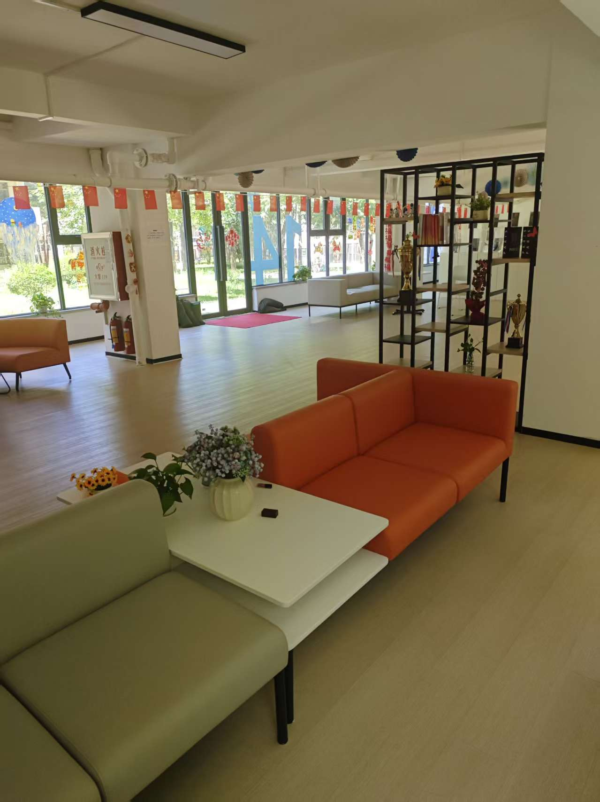
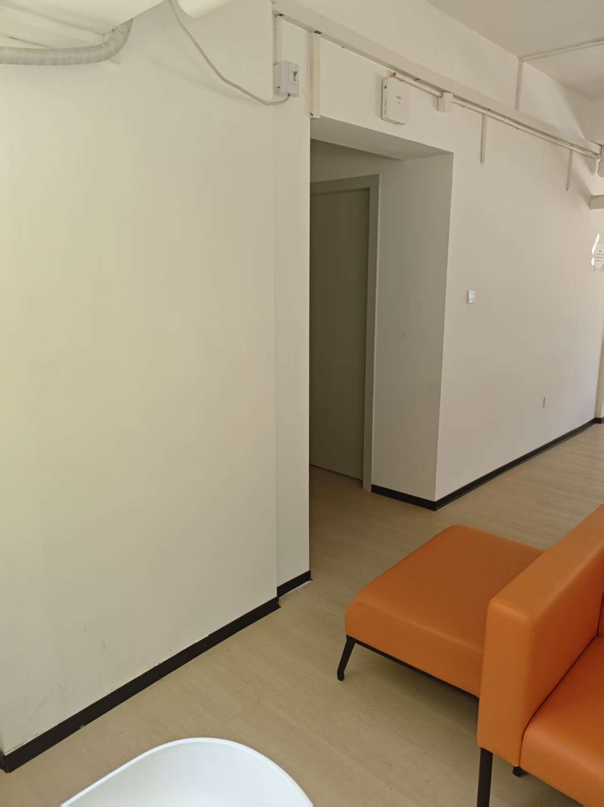
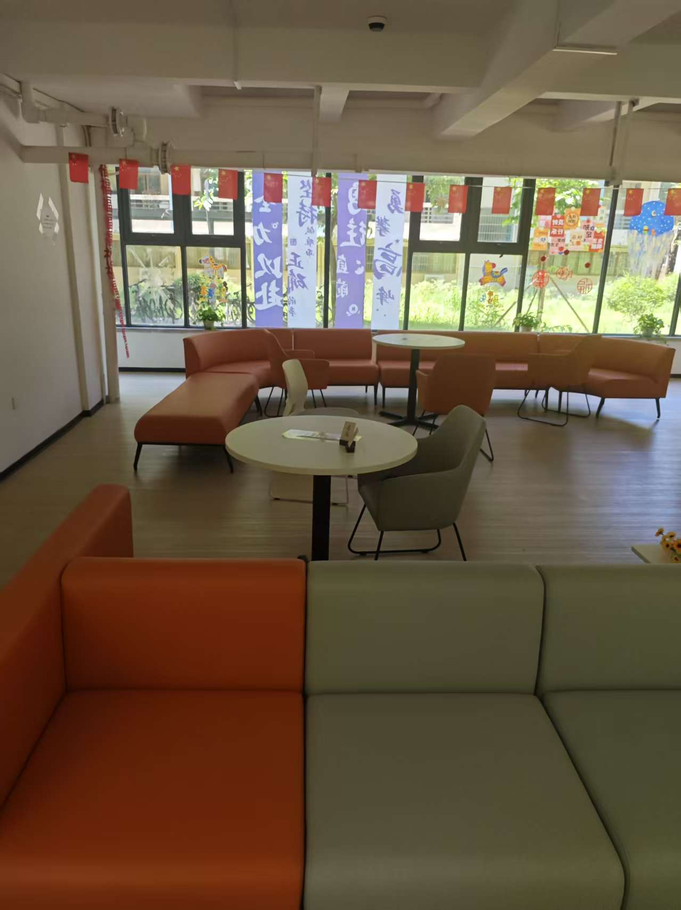
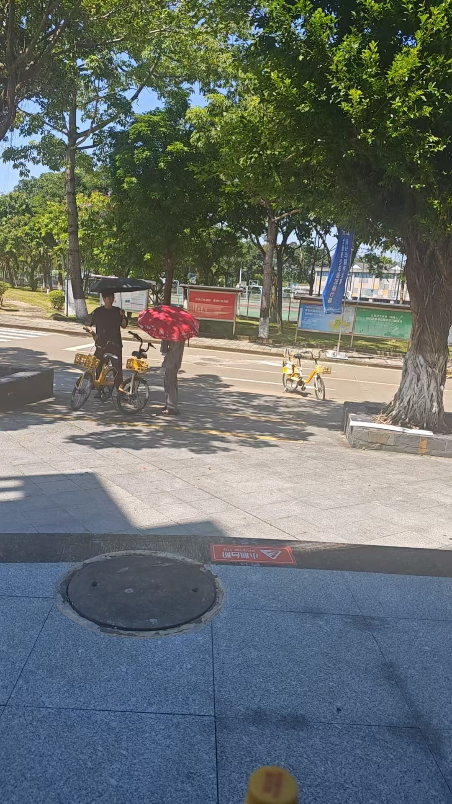

# CTSAI-A100 室内 / 室外场景与数据采集说明


## 1. 实验目的


本项目基于 CTSAI-A100 开展室内与室外环境 ADC 数据采集实验，并结合 MATLAB 雷达信号处理和 LFMCW 综合仿真，对不同环境中的距离、多普勒及静态杂波特征进行观察。


实测部分主要包括：


* ADC TXT 数据解析

* Range FFT

* Range-Doppler / 2D-FFT

* MTI 静态与近静态杂波抑制

* 室内与室外代表场景结果展示


MATLAB 仿真部分用于进一步分析 LFMCW 目标回波、差频信号、时频特征以及雷达参数变化规律。


## 2. 实测场景与实验布置

完整实验包含三组室内场景和一组室外场景。根据实际采集记录及现场照片，四组数据对应关系如下：

| 数据组               | 测试环境 | 主要目标 / 状态  | 目标运动特征                    |
| ----------------- | ---- | ---------- | ------------------------- |
| `indoor_case_01`  | 室内   | 被试者        | 在雷达观测区域内进行左右横向移动          |
| `indoor_case_02`  | 室内   | 坐在椅子上的被试者  | 采集开始阶段存在小幅动作，后半段保持静止      |
| `indoor_case_03`  | 室内   | 无人为运动目标    | 全程保持空旷，用于观察室内静态背景         |
| `outdoor_case_01` | 室外   | 室外自然环境中的物体 | 未保存可用于可靠恢复单一受控目标运动轨迹的完整记录 |

原始采集目录分别为：

```text
adc_test0806indoor_20260806132405350
adc_test0806indoor01_20260806134148375
adc_test0806indoor02_20260806140024188
adc_test0806outdoor_20260806142735600
```

### 2.1 indoor_case_01：被试者左右移动

该场景在室内环境中采集。实验中存在一名被试者，并在雷达观测区域内进行左右方向的横向移动。

室内环境中还包含墙面、座椅、桌子及其他固定结构，这些物体会形成静态反射和多径分量。因此，该场景可用于观察人体横向运动响应与室内静态背景同时存在时的 Range Spectrum、Range-Doppler 和 MTI 特征。

现场环境如下：



### 2.2 indoor_case_02：坐姿目标由运动转为静止

该场景同样在室内环境中采集。被试者坐在椅子上，在采集开始阶段存在短时间、小幅度的人体动作，随后在采集后半段保持基本静止。

现场环境如下：



### 2.3 indoor_case_03：空旷室内静态背景

该场景为室内空旷环境，采集过程中未人为设置运动目标。

场景中主要保留墙面、地面、座椅、桌子以及其他固定室内结构产生的静态环境反射。

现场环境如下：



### 2.4 outdoor_case_01：室外自然环境

该场景在室外道路及活动区域进行采集。

现场环境包含道路、树木、自行车、人员及其他室外物体，传播条件和固定背景结构与室内场景明显不同。

现场环境如下：




## 3. 数据采集规模


每个场景完整采集：


* 20 个 run

* 每个 run 包含 Rx0-Rx3 四个接收通道

* 每个场景共 80 个 ADC TXT 文件


因此完整实验数据规模为：


```text

4 scenes × 20 runs × 4 RX

= 320 ADC TXT files

```


完整原始 ADC TXT 数据总量约为 379 MB。


## 4. 仓库中的代表数据


考虑到完整 ADC 数据体积较大，本 Community Project 不直接提交全部 320 个原始 TXT 文件。


仓库中为每个场景保留 `run_001`：


```text

data/measured/

├── indoor_case_01/

│   └── run_001_Pf0_Rx0~Rx3.txt

├── indoor_case_02/

│   └── run_001_Pf0_Rx0~Rx3.txt

├── indoor_case_03/

│   └── run_001_Pf0_Rx0~Rx3.txt

└── outdoor_case_01/

    └── run_001_Pf0_Rx0~Rx3.txt

```


因此仓库提供：


```text

4 scenes × 1 representative run × 4 RX

= 16 ADC TXT files

```


这些代表数据用于复现项目中的主要 MATLAB 实测信号处理流程。


完整 20-run 数据保留在原始实验数据存储位置，可用于进一步的本地批量分析。


## 5. ADC 数据规格


仓库中的代表数据已完成格式检查。


所有代表数据均具有：


* Profile：Pf0

* Receive channels：Rx0-Rx3

* Samples per chirp：1024

* Chirps per frame：256


全部 16 个 TXT 文件均能够由项目 ADC 解析程序正常读取。


每个 TXT 文件在标准 ADC payload 后还存在 1 个 trailer 数值，当前解析程序将该数值作为尾部数据忽略，不影响完整 ADC payload 的读取和解包。


## 6. 实测雷达配置


本项目使用的 Pf0 配置主要包括：


* Start frequency：76.3 GHz

* FMCW bandwidth：300 MHz

* Chirp ramp-up：43 us

* Chirp period：48 us

* ADC frequency：25 MHz

* Range FFT size：1024

* Doppler FFT size：256

* TX mode：SISO


根据当前配置得到：


* Range resolution：约 0.5245 m/bin

* Velocity resolution：约 0.1599 m/s/bin

* 当前处理对应的无模糊速度范围：约 ±20.46 m/s


这些参数用于实测 Range-Doppler 图中的距离和径向速度物理坐标计算。


## 7. 代表性实测处理


项目默认对四个场景的 `run_001_Pf0_Rx0.txt` 进行代表性处理。


每个场景生成：


* Range Spectrum

* Range-Doppler Map Before MTI

* Range-Doppler Map After MTI2


结果位于：


```text

results/measured/

├── indoor_case_01/

├── indoor_case_02/

├── indoor_case_03/

└── outdoor_case_01/

```


## 8. 室内 / 室外场景分析边界


室内环境通常可能包含墙面、家具及其他固定结构形成的复杂反射和多径。


室外环境具有不同的传播条件和背景杂波组成。


本项目通过实测 Range Spectrum、Range-Doppler 和 MTI 前后结果展示不同环境下的雷达数据特征。


由于当前仓库提供的是各场景的代表性样本，因此这些结果主要用于场景展示和信号处理流程复现，不用于声明统一的 CTSAI-A100 产品检测性能。


MATLAB 仿真结果、CTSAI-A100 实测结果以及产品实际能力在项目文档中分别说明。


