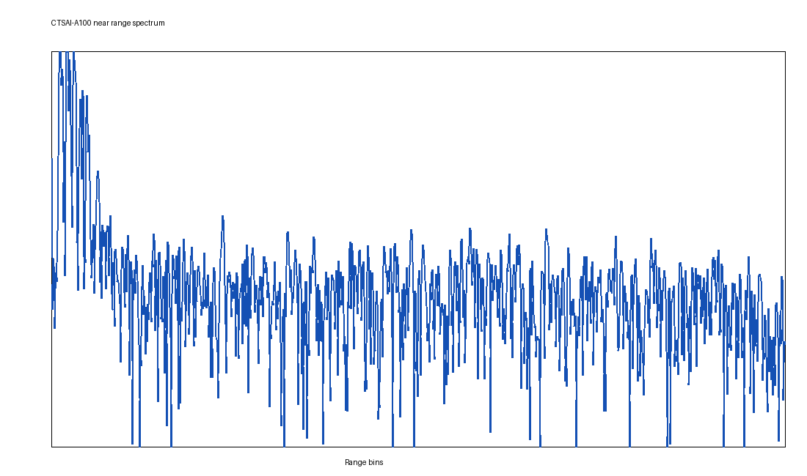
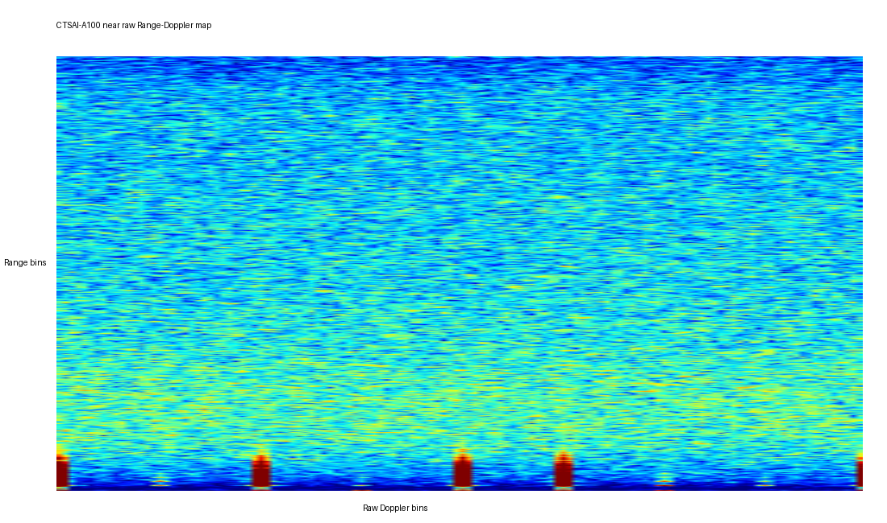
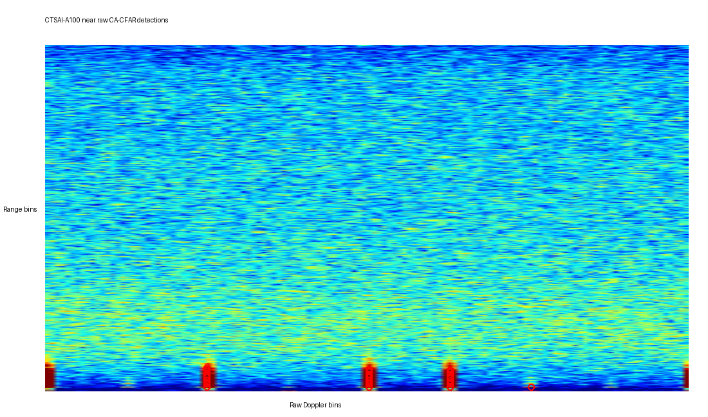
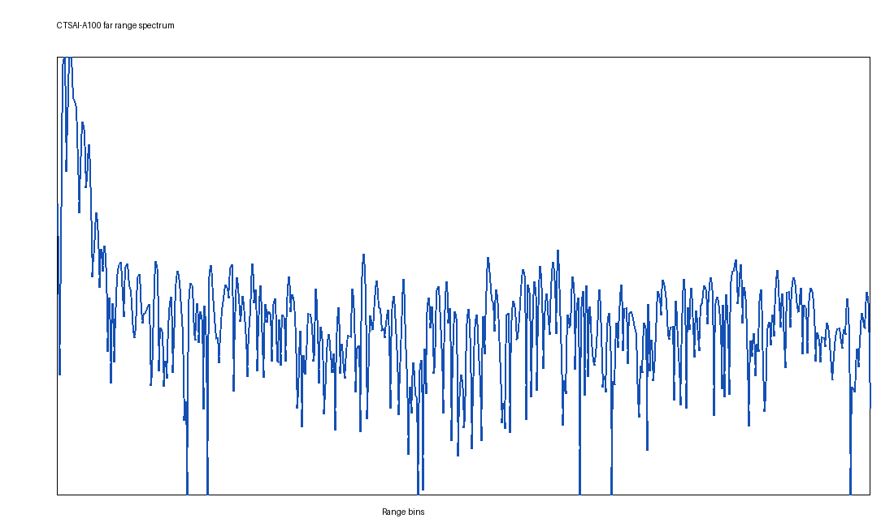
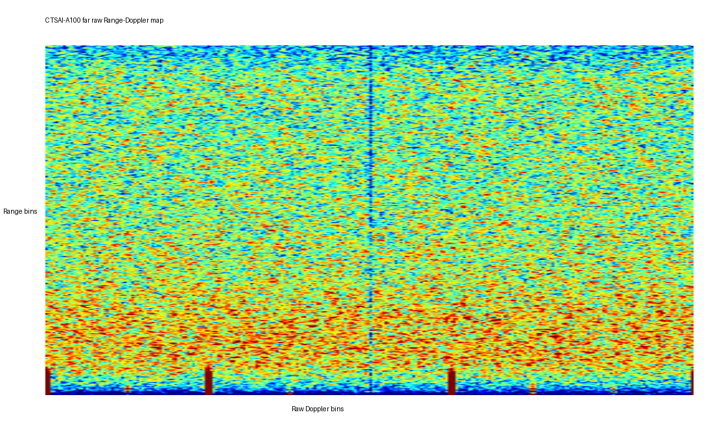

# 从公开 ADC 数据到可复现诊断：CTSAI-A100 MATLAB 信号处理流水线与独立验证

> 作者：GitHub [@btlqql](https://github.com/btlqql)  
> 社区贡献：[Super-Radar/CTSAI-A100 PR #49](https://github.com/Super-Radar/CTSAI-A100/pull/49)  
> 测试性质：仓库公开 ADC 数据的离线处理与独立数值验证，不包含新硬件采集或现场雷达测试。

## 一、项目背景

CTSAI-A100 仓库已经公开了近距、远距 ADC 示例数据以及对应的 HXX 配置。对于希望学习雷达基带处理或进行二次开发的开发者，仅有原始文件还不够：还需要一条能够检查输入、完成频域处理、导出中间结果，并清楚说明结果有效边界的工程流程。

本项目完成了一套 MATLAB 参考实现，将仓库中的公开 ADC 文本数据转换为距离谱、原始距离-多普勒图和二维 CA-CFAR 诊断结果。同时提供一套独立 NumPy 验证器，用相同的输入和处理公式检查数据维度、配置一致性和数值输出。

公开数据呈现出尚未由公开元数据完整描述的 DDMA 结构。如果直接把原始 Doppler FFT 横坐标解释成物理速度，或者直接用四路 RX 数据估计角度，可能产生看似完整但缺乏依据的结果。因此，本项目把“哪些结果已经算出”和“哪些物理量目前不能可靠恢复”同时写入代码、CSV 和验证报告。

## 二、已完成的目标

当前工程已经完成以下内容：

1. 自动读取近距、远距 HXX 配置，并使用配置中的采样率、带宽、chirp 数和 FFT 长度；
2. 读取四路 RX 文本文件，严格检查文件数量和 payload 长度；
3. 将每个 32 位存储字拆分为两个有符号 16 位 ADC 样本；
4. 完成逐 chirp 直流分量去除、Hann 加窗、Range FFT 和原始 Doppler FFT；
5. 对四路 RX 功率进行非相干积累；
6. 使用不依赖工具箱的二维 CA-CFAR 和 3×3 局部极大值筛选输出诊断检测点；
7. 导出 PNG、CSV、配置报告和 MAT 工作区；
8. 在 DDMA 元数据不完整时保留原始 Doppler bin，并阻止输出未经解码的物理速度和角度；
9. 使用独立 NumPy 程序复现 HXX/ADC/FFT/CFAR 计算并生成已提交的验证结果。

## 三、测试场景、数据与环境

### 3.1 测试场景说明

本项目没有重新连接 CTSAI-A100 硬件，也没有参与公开样例数据的现场采集。测试对象是仓库已经提供的两组数据：

- 近距 profile：`sensor_config_init1.hxx` 与对应四路 `f1` ADC 文本；
- 远距 profile：`sensor_config_init0.hxx` 与对应四路 `f0` ADC 文本。

因此，本文的“测试图片”均为公开 ADC 数据经过离线处理后生成的频谱图和诊断图，不是雷达摆放或目标运动的现场照片。由于原始采集场景的完整布置、目标真值和标定信息不在本工程的验证范围内，本文不据此声称检测距离、速度精度、角度精度或产品性能。

### 3.2 验证环境

提交结果使用以下环境生成：

- Python 3.12.13；
- NumPy 2.3.5；
- Pillow 12.2.0；
- MATLAB 参考代码目标版本为 R2020b 或更高版本，且只使用基础 MATLAB 函数。

本次提交的图、CSV 和日志由 NumPy 独立验证器生成；本文不声称已经在本机完成原生 MATLAB 执行或硬件联调。

## 四、ADC 解析与配置加载

每个 profile 包含四个 RX 文本文件。每个文件具有一个前导字段和 131072 个 payload 字。一个 payload 字包含两个连续的二补码有符号 16 位采样值：

```text
uint32 word = [earlier int16 sample][later int16 sample]
```

解析器先验证四路文件是否齐全以及 payload 长度是否符合配置，再完成拆分、符号转换和数据立方体重排。它不会通过静默截断或补零来掩盖输入错误。

两组公开数据得到的输入维度为：

| Profile | HXX 配置 | ADC 数据立方体 |
|---|---|---:|
| near | `sensor_config_init1.hxx` | 2048 × 128 × 4 |
| far | `sensor_config_init0.hxx` | 1024 × 256 × 4 |

## 五、信号处理流程

工程的主处理链如下：

```text
四路 RX 文本 + 官方 HXX 配置
  -> uint32/int16 解包与维度校验
  -> 逐 chirp 去直流与距离向 Hann 窗
  -> Range FFT，保留正频率半谱
  -> 慢时间 Hann 窗
  -> 原始 Doppler FFT 与 fftshift
  -> 四路 RX 非相干功率积累
  -> 二维 CA-CFAR 与局部极大值筛选
  -> 距离 / 原始 Doppler bin 诊断表
  -> 物理速度与角度有效性保护
```

### 5.1 距离向处理

对每个 chirp 和 RX 通道去除直流分量，再使用 Hann 窗降低旁瓣，随后执行 Range FFT。对于实数 ADC 输入，仅保留 FFT 的正频率半谱。距离坐标由 HXX 中的采样率、调频带宽、ramp 时间和 FFT 长度共同计算，而不是写死在程序里。

### 5.2 原始 Doppler 处理

Range FFT 结果沿慢时间维加窗并执行 Doppler FFT，`fftshift` 只用于重排原始 Fourier bin。由于公开资料尚不足以确定 DDMA 相位编码、bin 偏移、初相、DDMA chirp 周期定义和解模糊方式，重排后的中心 bin 不能被认定为组合 TX 频谱的物理零速度位置。

为避免删除有效的 DDMA 分量，本工程没有进行慢时间均值相减，也没有抑制中心 bin。CSV 中保留 `doppler_bin`，而 `velocity_mps` 和 `angle_deg` 留空，并通过 `kinematics_valid=False` 与 `processing_status=raw_ddma_not_decoded` 明确标记结果边界。

### 5.3 二维 CA-CFAR

检测器在距离-原始 Doppler 功率图上执行二维单元平均 CFAR：距离向和 Doppler 向训练单元分别为 8 和 6，保护单元分别为 2 和 2，设定虚警概率为 `1e-4`。随后使用 3×3 局部极大值筛选，减少同一响应产生多行相邻结果。

这里输出的是对处理链和数据响应的诊断检测点，不能直接等同于经过 DDMA 解码、标定和目标聚类后的真实目标数量。

## 六、验证结果与测试图片

### 6.1 近距 profile

近距数据由 `2048 × 128 × 4` 的 ADC 数据立方体生成 `1024 × 128 × 4` 的原始 Range-Doppler 数据立方体。所有输出均为有限数值，CA-CFAR 导出 32 个原始频谱诊断检测点。



图 1：近距公开 ADC 数据的距离谱。该图由独立 NumPy 验证器生成。



图 2：近距原始距离-多普勒图。横轴表示未解码的原始 Doppler bin，不表示物理速度。



图 3：近距 CA-CFAR 诊断结果，红色圆圈为原始频谱诊断检测点。

### 6.2 远距 profile

远距数据由 `1024 × 256 × 4` 的 ADC 数据立方体生成 `512 × 256 × 4` 的原始 Range-Doppler 数据立方体。所有输出均为有限数值，CA-CFAR 导出 3 个原始频谱诊断检测点。



图 4：远距公开 ADC 数据的距离谱。该图由独立 NumPy 验证器生成。



图 5：远距原始距离-多普勒图。横轴表示未解码的原始 Doppler bin，不表示物理速度。


图 6：远距 CA-CFAR 诊断结果，红色圆圈为原始频谱诊断检测点。

验证日志汇总如下：

| Profile | 原始 RD 维度 | 数值有限 | 诊断检测点 | 慢时间均值去除 | 中心 bin 抑制 | 物理速度有效 | 角度有效 |
|---|---:|---:|---:|---:|---:|---:|---:|
| near | 1024 × 128 × 4 | 是 | 32 | 否 | 否 | 否 | 否 |
| far | 512 × 256 × 4 | 是 | 3 | 否 | 否 | 否 | 否 |

## 七、独立验证的作用

MATLAB 主程序和 NumPy 验证器分别实现配置读取、ADC 解包、Range FFT、原始 Doppler FFT、四路 RX 功率积累和 CA-CFAR。NumPy 验证器还检查：

- ADC 与 RD 数据立方体维度是否符合 HXX；
- 数值结果是否全部为有限值；
- 未完成 DDMA 解码时是否禁止导出物理速度和角度；
- 是否错误启用了慢时间均值去除或中心 bin 抑制；
- CSV、图片和验证日志是否能完整生成。

这项验证说明公开输入能够沿设计的数学流程稳定处理，并验证了结果边界保护逻辑；它不替代 MATLAB 原生运行测试、硬件测试或带目标真值的性能评估。

## 八、工程复现

在仓库根目录运行独立验证：

```powershell
python "community/projects/a100-matlab-adc-pipeline-validation/validator/run_reference_validation.py"
```

如具备 MATLAB R2020b 或更高版本，可进入项目目录或将其加入 MATLAB 路径，然后分别运行：

```matlab
main('near');
main('far');
```

MATLAB 主程序将结果写入 `results/near/` 和 `results/far/`。独立验证器的已提交结果位于 `validator/results/near/` 和 `validator/results/far/`，每个 profile 包含：

- `01_range_spectrum.png`：距离谱；
- `02_raw_range_doppler_map.png`：原始距离-多普勒图；
- `03_raw_cfar_detections.png`：CA-CFAR 诊断检测图；
- `04_processing_status.png`：处理状态及有效性说明；
- `detections.csv`：诊断检测表；
- `validation.txt`：维度、配置和有效性检查结果。

## 九、当前版本边界

当前提交已经完成公开 ADC 数据的解析、距离向处理、原始 Doppler 处理、CA-CFAR 诊断和独立数值验证，但不包含以下结果：

- 新的 A100 硬件采集和现场目标真值；
- 原生 MATLAB 环境执行记录；
- DDMA TX 分离及物理速度恢复；
- 标定后的虚拟阵列构造与方位角输出；
- 速度解模糊、多帧跟踪和产品固件等效性验证；
- 检测距离、速度精度、角度精度、虚警率等产品性能结论。

这些边界已经写入代码配置、结果表和验证日志。工程不会使用缺失的元数据补出看似完整的物理量。

## 十、小结

本项目已经把 CTSAI-A100 仓库公开的近距、远距 ADC 示例整理为一条可读、可运行、可检查的 MATLAB 信号处理参考流程，并通过独立 NumPy 实现生成了可复现的频谱、检测表和验证日志。工程的主要价值不仅是得到距离谱和原始距离-多普勒结果，还在于对未公开完整描述的 DDMA 数据设置明确的有效性保护：能够验证的结果正常导出，缺少依据的速度和角度保持为空。

对于希望理解 A100 ADC 文件组织、HXX 参数映射、Range/Doppler FFT 和二维 CA-CFAR 的开发者，该工程可以直接作为公开数据离线分析与二次开发的起点。
