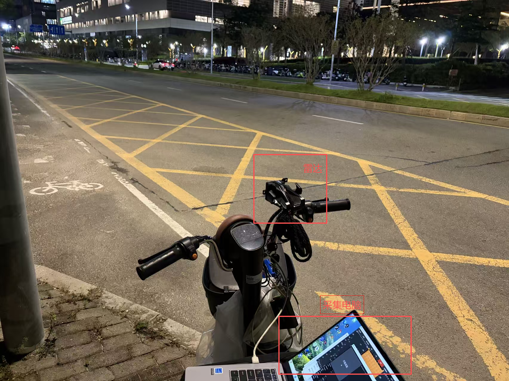

# 场景与 CTSAI-A100 实测数据采集说明


## 1. 实验场景


本项目选择车辆周界感知作为 CTSAI-A100 的应用实验场景，主要比较以下三种状态：


* 空环境

* 车辆靠近雷达

* 车辆远离雷达


实验目标是结合 CTSAI-A100 ADC 实测数据与 MATLAB LFMCW 雷达仿真，观察不同场景下的距离、多普勒以及静态杂波特征，并分析 MTI 处理前后的结果差异。


目标类型为车辆。

### 1.1 实验布置与测试环境

实测数据使用 CTSAI-A100 雷达进行采集。实验过程中，雷达固定在电动车前部车把附近，采集电脑随车放置并与雷达连接，用于完成 ADC 数据采集与保存。

雷达安装后大致朝向电动车前方的道路区域。该安装方式便于在室外道路环境中进行车辆周界场景的数据采集，并保持雷达和采集设备作为一套整体平台进行移动和布置。

测试场景为室外道路环境。实验区域包含道路、路缘、绿化带、建筑物以及路边设施等静态反射体，因此实测 ADC 数据除车辆目标外，也包含来自地面和周围静态环境的杂波与反射。

实验现场及设备布置如下图所示：



图中 CTSAI-A100 雷达固定于电动车前部，采集电脑用于连接雷达并保存采集数据。

### 1.2 车辆运动场景

本项目主要采集以下三类实测场景：

1. **空环境（empty）**：作为静态环境基线；
2. **车辆靠近（vehicle_approaching）**：目标车辆沿道路向雷达所在区域靠近；
3. **车辆远离（vehicle_receding）**：目标车辆沿道路逐渐远离雷达所在区域。

车辆运动数据由多个独立 acquisition run 组成。由于 ALL channel 数据采集和保存所需时间较长，各 run 应理解为车辆运动过程中的离散场景样本，而不是严格连续、等时间间隔的运动轨迹。


## 2. 数据采集方式


实测数据使用 CTSAI-A100 采集，采用 ALL channel 方式保存 ADC TXT 数据。


数据包含 Rx0、Rx1、Rx2、Rx3 四个接收通道。


本项目使用的 ADC 数据规格为：


* Samples per chirp：1024

* Chirps per frame：256

* Profile：Pf0

* Receive channels：Rx0-Rx3


全部数据文件均能够由项目中的 ADC TXT 解析程序正常读取。


每个 TXT 文件中除标准 ADC payload 外还存在 1 个尾部数值，当前解析器将其作为 trailer 忽略，不影响完整 ADC payload 的读取。


## 3. 数据数量


本项目共包含 44 个 ADC TXT 文件。


### 空环境


采集 1 组数据：


* 1 个 run

* 每个 run 包含 Rx0-Rx3

* 共 4 个 TXT 文件


### 车辆靠近


采集 5 组数据：


* 5 个 run

* 每个 run 包含 Rx0-Rx3

* 共 20 个 TXT 文件


### 车辆远离


采集 5 组数据：


* 5 个 run

* 每个 run 包含 Rx0-Rx3

* 共 20 个 TXT 文件


## 4. 数据目录


```text

data/measured/

├── empty/

│   └── run_001_Pf0_Rx0~Rx3.txt

├── vehicle_approaching/

│   ├── run_001_Pf0_Rx0~Rx3.txt

│   ├── ...

│   └── run_005_Pf0_Rx0~Rx3.txt

└── vehicle_receding/

    ├── run_001_Pf0_Rx0~Rx3.txt

    ├── ...

    └── run_005_Pf0_Rx0~Rx3.txt

```


## 5. 采集时序限制


需要特别说明，本次 ALL channel 数据采集速度较慢。


在当前采集流程下，单个 RX 的一帧数据采集和保存需要十几秒左右。因此车辆靠近和车辆远离场景中的 run_001 至 run_005 不能解释为严格连续、等时间间隔采样的车辆运动轨迹。


这些数据应当理解为车辆运动过程中的多个离散场景样本。


同时，由于 Rx0-Rx3 的采集并非理想的同时刻同步快照，本项目不会利用这批车辆数据进行严格的四通道相干角度估计。


实测部分主要用于：


* ADC 数据分析

* Range FFT

* Range-Doppler / 2D-FFT

* MTI 前后结果对比

* 空环境、车辆靠近和车辆远离场景的特征观察


连续、可控的车辆距离和径向速度变化主要通过 MATLAB LFMCW 仿真进行研究。


## 6. 实测雷达配置


本项目 Pf0 实测配置的主要参数为：


* Start frequency：76.3 GHz

* FMCW bandwidth：300 MHz

* Chirp ramp-up time：43 us

* Chirp period：48 us

* ADC frequency：25 MHz

* Range FFT size：1024

* Doppler FFT size：256

* TX mode：SISO


根据该配置得到：


* 距离分辨率约 0.5245 m/bin

* 速度分辨率约 0.1599 m/s/bin

* 当前处理下无模糊速度范围约 ±20.46 m/s


这些参数用于本项目实测 Range-Doppler 图的物理坐标计算。


## 7. 实验结果使用边界


实测数据用于展示真实 CTSAI-A100 ADC 数据中的距离、多普勒和静态杂波特征。


由于本次车辆采集不是严格连续运动序列，因此项目不会将 5 个 run 拼接为车辆连续轨迹，也不会把离散 run 间的变化作为精确车辆运动速度测量结果。


仿真结果、实测结果以及 CTSAI-A100 产品实际能力在本项目中分别说明，避免将理想仿真性能直接等同于实测产品性能。
