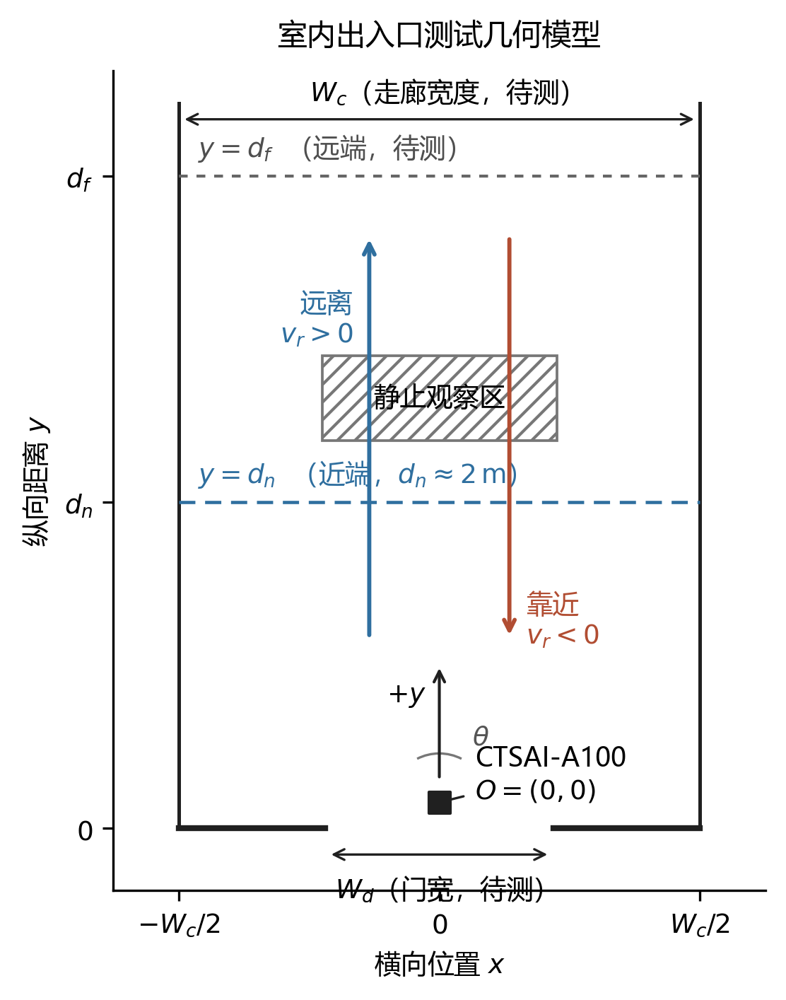
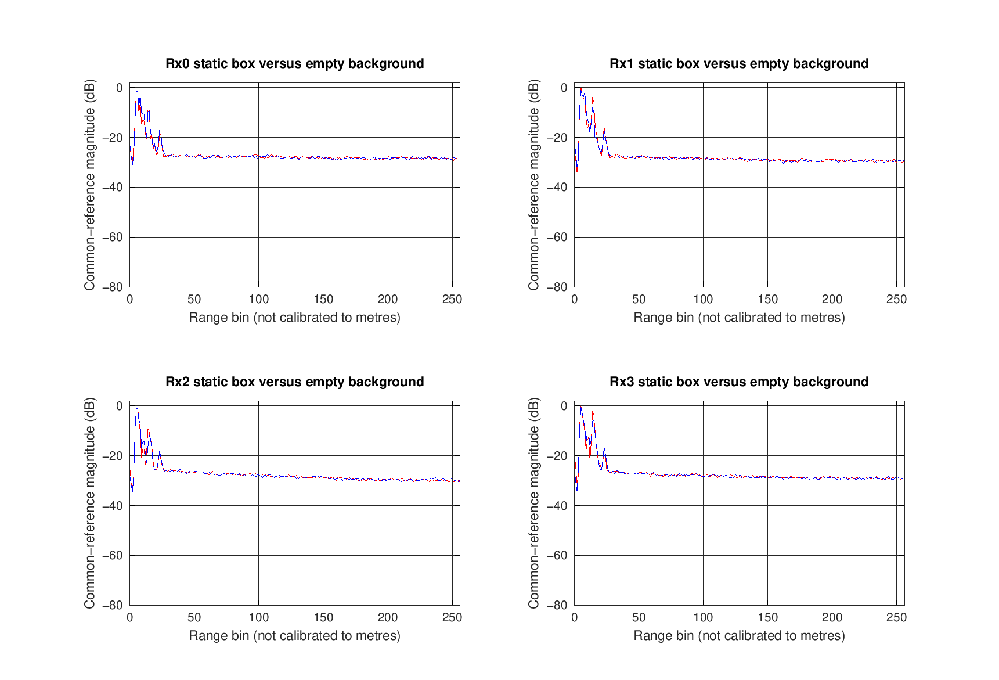
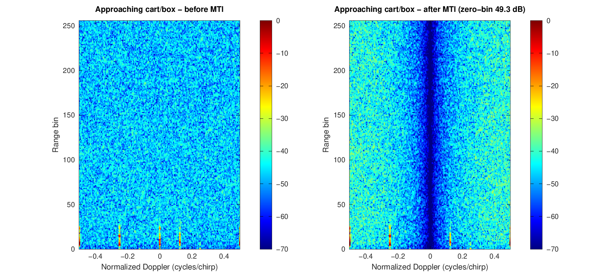
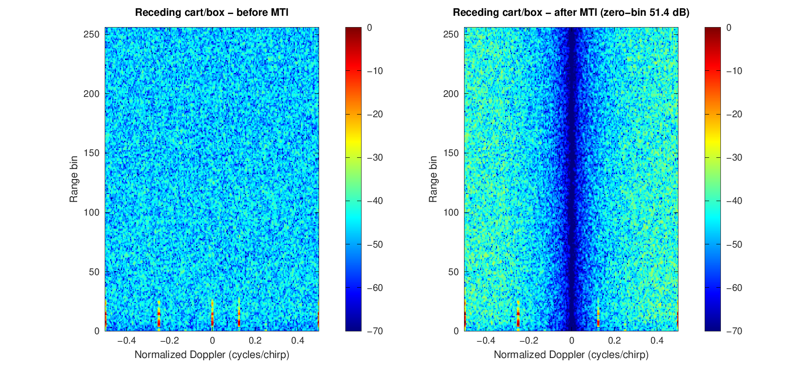

# 室内出入口人员通行与静止占用感知

> 当前状态：已完成首轮室内实测，并补充可复现的数据处理结果；现场精确尺寸和更多通行场景仍待复测。

## 1. 场景背景

教学楼楼道、实验室门口和室内走廊通常同时存在墙面、地面、门框、桌椅等静态反射体，也会出现人员进入、离开、短暂停留等低速运动过程。此类环境容易复现，适合用于验证 CTSAI-A100 在室内近距离条件下对人员运动的观测能力，并分析静态背景、运动方向和停留时间对结果的影响。

本场景不将雷达输出直接等同于可靠的“人数”或“占用状态”，而是先记录点云、跟踪目标或 ADC 数据，再依据连续帧中的距离、速度和目标状态形成实验判断。测试重点是回答：人员经过门口时能否形成连续轨迹，进入与离开方向能否区分，以及人员停止运动后输出会发生怎样的变化。

## 2. 测试场景与目标

CTSAI-A100 固定在门口或走廊一端，雷达主视场朝向人员通行方向。人员沿走廊中线完成靠近、穿越近端参考线、停留和远离等动作。当前已知近端位置距雷达约 2 m，正式采集前应使用卷尺复测雷达相位中心、门框、近端点和远端点之间的距离，并记录雷达安装高度与俯仰角。



图 1 使用雷达相位中心作为坐标原点 $O$，走廊横向和纵向分别记为 $x$、$y$。$d_n$ 为近端参考距离，当前约为 2 m；$d_f$、走廊宽度 $W_c$、门宽 $W_d$ 和安装角 $\theta$ 将在现场复测后填写。对于位置 $(x(t),y(t))$，目标径向距离和径向速度定义为

$$
r(t)=\sqrt{x^2(t)+y^2(t)},\qquad v_r(t)=\frac{\mathrm{d}r(t)}{\mathrm{d}t}
$$

本文约定 $v_r<0$ 表示靠近雷达，$v_r>0$ 表示远离雷达。图中的区域只用于定义采集动作，不代表雷达实际视场边界或探测性能。图片由[可复现的 Matplotlib 脚本](./scripts/generate_indoor_entryway_geometry.py)生成，并同时保留 [SVG 矢量版本](./images/indoor-entryway-test-geometry.svg)。早期的[采集规划图](./images/indoor-entryway-sensing-layout.png)及其 [SVG 源文件](./images/indoor-entryway-sensing-layout.svg)继续保留，用于记录图版演变；当前测试编号以本文表格为准。

建议至少设置以下测试组：

| 编号 | 场景 | 主要用途 |
|---|---|---|
| S0 | 空场，人员不进入检测区域 | 记录静态背景和虚警情况 |
| S1 | 单人由远端向雷达靠近 | 观察进入方向和距离变化 |
| S2 | 单人由近端向远端离开 | 观察离开方向和距离变化 |
| S3 | 单人在近端参考位置静止 | 观察低速至静止后的目标保持情况 |
| S4 | 单人在门口短暂停留后继续通行 | 观察运动—停留—运动状态转换 |
| S5 | 单人横向经过门口但不进入 | 检查系统是否将路过误判为进入事件 |
| S6 | 单人靠近参考线后转身返回 | 检查系统是否将折返误判为完整通行事件 |

每组动作建议重复不少于 3 次，并在采集记录中保留开始时间、动作方向、实际位置和异常情况。重复次数用于检查结果的一致性，不应只挑选最理想的一次展示。

## 3. 适合采集的数据类型

- RadarTools 输出的原始目标、跟踪目标和 CAN 记录，用于分析目标距离、速度、角度及连续帧轨迹；
- ADC 原始数据及对应雷达配置，用于进行距离维 FFT、多普勒维 FFT、MTI 等离线处理；
- 场景照片、雷达安装参数、地面测距标记和人工事件记录，用于解释数据对应的实际动作；
- 如条件允许，可使用普通相机记录仅供人工核对的时间参考视频，但应注意人员隐私，并在公开前进行处理。

## 4. 可研究的问题

1. 空场中的门框、墙面和地面反射在距离维或距离—多普勒图中呈现什么特征；
2. 人员靠近与远离时，径向速度符号和距离变化趋势是否一致；
3. 人员从行走转为静止后，点云、跟踪目标和 MTI 输出分别如何变化；
4. 不同参考距离、行走速度和停留时间是否影响目标轨迹的连续性；
5. 仅依靠单次检测结果判断“有人”可能产生哪些误判，连续帧规则能否改善稳定性。

## 5. 推荐工具链

- CTSAI-A100 与 RadarTools：设备配置、点云/目标数据查看和原始数据采集；
- MATLAB：ADC 数据读取、Range FFT、Doppler FFT、2D FFT、MTI 处理和结果绘图；
- Python（可选）：CSV/ASC 数据整理、时间序列统计和轨迹可视化；
- Matplotlib：按统一坐标和样式生成可复现的实验布置图；
- 卷尺、地面胶带或可移除标记：统一近端、远端和停留位置。

## 6. 实验流程

```text
复测场地与安装参数
        ↓
固定雷达并确认 RadarTools 数据正常
        ↓
采集空场基线 S0
        ↓
依次采集靠近、离开、静止、短暂停留、横向经过和折返场景
        ↓
整理场景编号、时间戳、动作记录和数据文件
        ↓
绘制距离/速度时间序列与点云轨迹
        ↓
对 ADC 数据执行 FFT 和 MTI 处理（如采集）
        ↓
比较各场景结果并说明限制
```

分析时应优先使用统一坐标范围和色标，以便比较空场、运动和静止结果。进入与离开可依据距离随时间的增减趋势进行区分；静止占用则需要结合连续帧目标保持、零速度附近能量及算法输出共同判断，不宜仅凭单帧阈值下结论。

## 7. 注意事项与边界

- 示意图中的扇形区域只表示布置关系，不代表厂家给出的精确视场或性能承诺；
- 雷达应固定牢靠，采集期间不要移动支架或改变俯仰角，否则空场基线难以直接比较；
- 门框、金属柜和近距离墙面可能产生较强反射，应保留空场数据作为对照；
- 静止人员并非严格静止，呼吸和身体微动可能造成弱回波；另一方面，MTI 会抑制零速度附近分量，因此“静止目标未持续输出”不能简单解释为硬件故障；
- 本实验用于研究和教学验证，结果受雷达配置、安装方式、目标姿态和环境影响，不代表商业化人数统计或安全监控性能；
- 现场照片和视频公开前应获得授权，避免出现可识别的人脸、姓名、门牌或其他隐私信息。

## 8. 首轮实测结果

以下图片来自仓库中的 [A100 室内小推车与 MTI 工程](../../community/projects/a100-indoor-cart-mti/README.md)。工程收录 2026 年 8 月 2 日采集的 31 个正式文件，运行 `run_all.m` 前会按照[数据清单](../../community/projects/a100-indoor-cart-mti/data/manifest.csv)逐项校验文件大小和 SHA-256。实测 ADC 仅在距离 bin 和归一化多普勒轴上分析，不使用缺失的硬件参数换算物理速度。

首轮采集地点为室内房间，能够验证静态背景、小推车靠近/远离和人员静止等处理流程，但不能代替后续走廊门口的精确尺寸复测。



图 2 对比四个接收通道的静止塑料箱体和空场距离谱。同一 Rx 的两条曲线使用共同参考峰值，因而可以比较通道内相对幅度；横轴仍为距离 bin，不能解释为准确距离。近距离若干谱峰在两种场景中同时存在，说明室内固定背景不能仅靠单帧峰值直接剔除。


图 3 给出 RawTarget 中时间、距离和速度符号一致的保守检测包络。小推车靠近段由 2.62 m 减至 1.57 m，小推车远离段由 1.20 m 增至 2.89 m，人员短距离远离段由 3.24 m 增至 4.01 m。靠近与远离来自不同采集会话，图中连线只表示各会话的总体运动趋势，不是一次连续往返，也不是身份轨迹。



图 4 为小推车靠近场景的实测距离—多普勒结果。一次脉冲对消后，零多普勒邻域相对处理前抑制 49.3 dB；左右面板共用处理前峰值和相同色标。该数值描述 bin 域静态分量变化，不等同于目标检测增益。



图 5 为小推车远离场景的同类处理结果，零多普勒邻域抑制度为 51.4 dB。靠近和远离场景的 DDMA 固定频带结构相近；由于采集文件缺少完整可核验的波形参数，横轴保留为归一化多普勒频率，不换算为物理速度。


图 6 使用固定 `2.5～3.1 m`、`−20°～5°` ROI 比较新空场和约 3 m 静止人员。空场 268 帧中没有 ROI 检测；静止人员 266 帧中有 163 帧出现检测，帧检出比例为 61.3%，中位距离为 2.79 m，中位 SNR 为 29.5 dB。结果说明静止人员能够产生可观察输出，但不能保证逐帧持续存在。

## 9. 公开案例与本项目的实验取舍

以下公开案例使用的雷达、安装方式和处理算法并不相同。本项目只借鉴其中可复现的场景设计和记录方法，不直接套用其检测阈值，也不将公开结果解释为 CTSAI-A100 的性能。

| 公开案例 | 原案例的实验做法 | 本项目采用的部分 | 不直接照搬的部分 |
|---|---|---|---|
| [TI 自动门参考设计 TIDEP-01018](https://www.ti.com/lit/ug/tiduer1b/tiduer1b.pdf) | 分别测试人员靠近、远离、横向经过、多通道通行，并将坐标轨迹与现场照片并列展示 | 设置 S1、S2、S5 和 S6，明确区分“靠近”“经过”和“实际穿越” | 不使用其开门状态、三通道划分和到达时间阈值 |
| [TI 人员计数与跟踪 TIDEP-01000](https://www.ti.com/lit/ug/tidue71d/tidue71d.pdf) | 在地面布置已知坐标标记，固定相机记录人工真值；包含单人在 3 m 处停留 10 s、多人进入后静止等测试向量 | 使用地面参考点、固定机位和重复测试，记录人员停止与离开的人工时间戳 | 当前阶段先完成单人基线，不直接复现其多人密度与跟踪性能指标 |
| [Infineon 顶装占用检测实验](https://www.infineon.com/assets/row/public/documents/24/42/infineon-an141319-ceiling-mounted-occupancy-detection-using-xensiv-demo-bgt60tr13c-60-ghz-radar-applicationnotes-en.pdf) | 将测试区划分为 1 m 网格，在各网格位置采集约 15 s 静止数据，并记录雷达坐标方向 | 固定近端、远端和静止位置，统一停留时间，保留坐标与安装方向 | 本项目采用门口侧向或正向安装，不引用其顶装覆盖范围 |
| [TI 3D entryway counting 演示](https://www.ti.com/video/6250724938001) | 关注同时进出、前后紧跟以及靠近后折返造成的错误计数 | 增加 S6 折返反例；多人同时通过作为后续扩展 | 当前版本不宣称完成人数统计，也不将演示能力视为 A100 已具备能力 |
| [TI 区域占用检测 TIDEP-01003](https://www.ti.com/lit/ug/tiduea7/tiduea7.pdf) | 预先定义空间区域，再根据区域内点云数量判断占用 | 将近端线、静止区和门口通行区作为独立几何对象记录 | 不采用原设计的点数阈值；阈值必须根据 A100 实测空场与人员数据重新确定 |
| [mmCounter 静止人员计数研究](https://arxiv.org/abs/2512.10357) | 对实验室和走廊中的静止人员采集原始 IQ 数据，分析呼吸与身体微动；同时指出静止阶段点云可能明显变稀疏 | 将 S3 的点云保持与 ADC 微动分析分开讨论，并记录环境变化带来的多径差异 | 该研究使用高分辨率级联成像雷达，其算法和结果不能直接迁移到 A100 |
| [多场景室内人员检测与跟踪](https://doi.org/10.1155/2021/6657709) | 在走廊、会议室和研讨室采集数据；雷达固定在约 1.8～2 m 高度，并用相机和地面网格记录参考位置 | 为采集文件增加环境编号，同一动作至少在走廊和门口两种布置下复测 | 原案例的 IWR1642BOOST 配置、6 m 测区和算法结果不作为 A100 参数 |
| [室内毫米波雷达鬼影抑制](https://doi.org/10.3390/s25113377) | 在大厅、走廊、会议室和办公室等 63 个场景采集点云；窄走廊中，靠近真实目标的鬼影可能形成连续轨迹 | 对 S0 和运动场景同时检查墙后点、贴墙轨迹及固定位置重复鬼影，并在结果图中单独标注疑似多径 | 原案例使用 24 GHz 雷达和学习模型，本项目不直接复用其模型或指标 |
| [真实餐厅人员计数与跟踪](https://doi.org/10.1587/transinf.2022EDP7145) | 在实际餐厅中采集点云，经聚类和帧间关联后统计人数及位置，并报告多场景下的位置误差与计数准确率 | 后续除展示代表性轨迹外，还统计重复实验的中位误差、漏检和误检 | 原案例的十人实验、算法结果和商业场景不能作为 A100 单雷达门口基线 |
| [电梯厅封闭空间人数估计](https://doi.org/10.3390/rs15194698) | 在连接走廊和三个电梯入口的大厅采集 22 组数据，以固定相机人工确认人数，并分别记录目标出现与消失的位置 | 为各入口设置位置编号，记录每帧参考人数及人员从哪个入口出现或离开 | 原案例的 77 GHz 车载雷达、HCM-LMB 滤波器和多人指标不直接迁移到 A100 |
| [人数与运动状态联合分类](https://doi.org/10.3390/s26041289) | 在带办公室背景杂波的室内区域采集 0～3 人数据，将人数和运动状态作为联合分类任务 | 采集记录分别设置“参考人数”和“动作状态”字段，避免把静止、走动和方向变化混为同一标签 | 原案例使用 60 GHz 雷达和 ResNet-50，其分类精度不作为 A100 结果 |
| [双雷达室内点云融合](https://doi.org/10.3390/electronics11142209) | 两台雷达在实验室和研讨室同步采集，配合固定相机与 4.5 m × 6 m 地面网格，重复执行行走、站立和交叉通行 | 单雷达阶段也保留统一时间戳和坐标系定义，为以后比较不同安装位置或扩展双雷达留出接口 | 当前工程不包含多雷达标定与融合，原案例的融合结果不能直接套用 |
| [点云体素化与静止姿态方向](https://doi.org/10.3390/su15043342) | 雷达侧装于约 0.5 m 高度，分别采集人员面向前、后、左、右四种静止方向，并保留较低检测阈值下的稀疏点云 | 将 S3 的身体朝向作为控制变量，每个固定距离至少记录正对和侧对两种姿态 | 本项目不进行坐姿方向分类，也不复用其 4 cm 距离分辨率配置 |
| [跨房间点云检测实验](https://doi.org/10.3390/s24020648) | 在较空办公室和具有明显多径及运动干扰的卧室分别采集数据，并将新参与者与新环境分开测试 | 将空旷走廊与门框、桌椅较多的门口场景分组汇报，不把随机拆帧结果当作跨环境验证 | 原案例面向跌倒分类并使用点云增强模型，本项目不评价跌倒检测能力 |
| [雷达与相机融合占用检测](https://doi.org/10.1587/transinf.2023EDP7106) | 针对雷达静态去除后站立或坐姿人员容易丢失的问题，引入相机辅助确认静止目标并同时展示人数与轨迹 | 相机仅作为人工真值来源，重点记录人员停止前后雷达输出是否中断以及中断持续时间 | 当前工程不进行传感器融合，也不引用原案例的融合检测准确率 |
| [多雷达智能建筑人数统计](https://arxiv.org/abs/2401.17949) | 在真实室内空间部署三台 FMCW 雷达，将各设备测量统一接入物联网平台，以扩大单雷达有限覆盖范围 | 当前先记录单雷达覆盖边界、盲区和输出接口，后续扩展时再讨论跨设备时间同步与重复目标合并 | 本项目当前仅使用一台 A100，不实现 Home Assistant 接入或三雷达融合 |
| [MMVR 多视角室内雷达数据集](https://arxiv.org/abs/2406.10708) | 在 6 个房间、多个日期和 25 名参与者条件下采集数据，并分别采用随机划分和跨环境划分评测 | 发布数据时按日期、房间、人员和场景分层组织，训练或调参数据不得与跨环境验证组混用 | 其多视角高分辨率热图、标注规模和基准任务超出 A100 当前工程范围 |
| [MARS 房间尺度连续活动感知](https://arxiv.org/abs/2309.11957) | 使用单台商用毫米波雷达连续观察宏动作与微动作，并在多人连续活动条件下同时考虑定位、跟踪和状态变化 | 将“进入—行走—停止—继续行走—离开”作为一段连续记录，不把各阶段拆成互不关联的短样本 | 当前项目只评价通行与静止保持，不进行 19 类活动识别或旋转扫描 |
| [检测与跟踪算法对照实验](https://doi.org/10.1109/ICSPIS67605.2025.11318383) | 分别比较高斯掩膜与 OS-CFAR、局部峰值与连通域检测、匈牙利关联与 DBSCAN 聚类，观察各步骤的取舍 | 后续若增加算法，应保持同一批输入数据和同一评价量，每次只替换一个处理模块 | 当前草案不复现论文中的完整实时系统，也不预设某一种算法必然适合 A100 |
| [反射与盲区压力测试](https://doi.org/10.3390/s24186074) | 在模拟房间中分别放置镜面反射物和金属遮挡物，主动制造假目标与盲区；每种条件重复固定路线并以视频和地面网格建立真值 | 增加可控反射板和遮挡物测试，逐次记录真实目标、假目标、漏检及轨迹交换，不只保留处理成功的样本 | 原案例使用 60 GHz MIMO 成品传感器和 UKF，不将其滤波结果视为 A100 性能 |

上述案例共同说明，出入口测试不能只采集一次“正常走过”。靠近后折返、横向路过、停止后继续运动和空场虚警都是必要的反例；现场测量点、人工动作记录和雷达输出必须使用同一场景编号关联。同一动作还应在不同室内布置下复测，窄走廊中的疑似多径轨迹应与真实轨迹分开标注，结果中同时报告误检、漏检和重复实验的统计量。

## 10. 建议评价量

第一阶段采用不依赖复杂分类器的基础评价量。设参考距离为 $r_{\mathrm{ref}}$，雷达输出距离为 $\hat r$，则固定位置的距离绝对误差为

$$
e_r=\left|\hat r-r_{\mathrm{ref}}\right|
$$

对 S1、S2、S5 和 S6，可根据人工动作记录判断径向运动方向。若有效方向判断总数为 $N_{\mathrm{valid}}$，其中正确数量为 $N_{\mathrm{correct}}$，则方向正确率定义为

$$
A_{\mathrm{dir}}=\frac{N_{\mathrm{correct}}}{N_{\mathrm{valid}}}
$$

空场虚警帧比例记为 $R_{\mathrm{FP}}=N_{\mathrm{FP}}/N_{\mathrm{empty}}$，其中 $N_{\mathrm{FP}}$ 为空场中出现非背景目标输出的帧数。人员实际位于测试区间的帧数记为 $N_{\mathrm{present}}$，形成有效连续轨迹的帧数记为 $N_{\mathrm{tracked}}$，轨迹保持比例为 $C=N_{\mathrm{tracked}}/N_{\mathrm{present}}$。

对于 S3，还应记录人员停止时刻 $t_{\mathrm{stop}}$ 和目标最后一次有效输出时刻 $t_{\mathrm{last}}$，定义静止保持时间 $T_{\mathrm{hold}}=t_{\mathrm{last}}-t_{\mathrm{stop}}$。如果目标在整段静止采集中一直存在，应将 $T_{\mathrm{hold}}$ 记为“不小于本次静止时长”，而不是假定目标会在采集结束后立即消失。

## 11. 后续提交计划

首轮提交已包含采集文件清单、数据读取脚本、运动检测包络和 ADC/MTI 对比结果。后续将补充走廊门口的精确尺寸与合规现场照片，并继续采集横向经过、折返和多人通行场景；新增结果仍保留原始记录和处理参数，避免用示意结果代替实测结果。

## 12. 参考资料

- [TI TIDEP-01018：毫米波雷达自动门参考设计](https://www.ti.com/tool/TIDEP-01018)
- [TI TIDEP-01000：室内人员计数与跟踪参考设计](https://www.ti.com/tool/TIDEP-01000)
- [TI TIDEP-01003：毫米波雷达区域占用检测参考设计](https://www.ti.com/tool/TIDEP-01003)
- [TI：3D people counting for entryways](https://www.ti.com/video/6250724938001)
- [Infineon：顶装 60 GHz 雷达室内占用检测应用笔记](https://www.infineon.com/assets/row/public/documents/24/42/infineon-an141319-ceiling-mounted-occupancy-detection-using-xensiv-demo-bgt60tr13c-60-ghz-radar-applicationnotes-en.pdf)
- [Toha 等：mmCounter 静止人员计数研究](https://arxiv.org/abs/2512.10357)
- [Huang 等：Indoor Detection and Tracking of People Using mmWave Sensor](https://doi.org/10.1155/2021/6657709)
- [Liu 等：Indoor mmWave Radar Ghost Suppression](https://doi.org/10.3390/s25113377)
- [Li 与 Hishiyama：Counting and Tracking People in a Restaurant Using mmWave Radar](https://doi.org/10.1587/transinf.2022EDP7145)
- [Li 等：Pedestrian Number Estimation with Millimeter-Wave Radar in Closed Spaces](https://doi.org/10.3390/rs15194698)
- [A Robust mmWave Radar Framework for Accurate People Counting and Motion Classification](https://doi.org/10.3390/s26041289)
- [mmWave Radar Sensors Fusion for Indoor Object Detection and Tracking](https://doi.org/10.3390/electronics11142209)
- [A Voxelization Algorithm for Reconstructing mmWave Radar Point Cloud](https://doi.org/10.3390/su15043342)
- [Fall Detection System Based on Point Cloud Enhancement Model for 24 GHz FMCW Radar](https://doi.org/10.3390/s24020648)
- [A mmWave Sensor and Camera Fusion System for Indoor Occupancy Detection and Tracking](https://doi.org/10.1587/transinf.2023EDP7106)
- [An IoT System for Smart Building Combining Multiple mmWave FMCW Radars](https://arxiv.org/abs/2401.17949)
- [MMVR: Millimeter-Wave Multi-View Radar Dataset and Benchmark for Indoor Perception](https://arxiv.org/abs/2406.10708)
- [MARS: Continuous Multi-User Activity Tracking via Room-Scale mmWave Sensing](https://arxiv.org/abs/2309.11957)
- [Evaluation of Detection and Tracking Approaches for People Counting Using mmWave Radar](https://doi.org/10.1109/ICSPIS67605.2025.11318383)
- [Improving the Accuracy of mmWave Radar for Ethical Patient Monitoring](https://doi.org/10.3390/s24186074)
