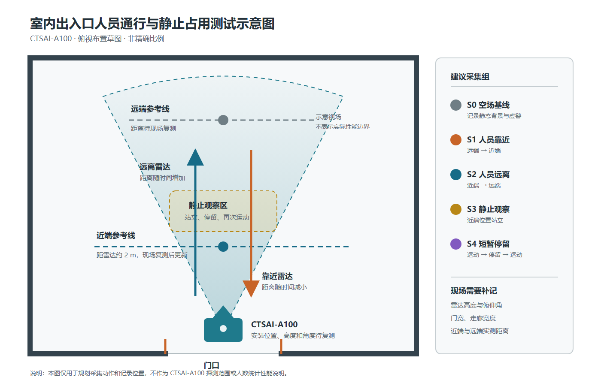

# 室内出入口人员通行与静止占用感知

> 当前状态：实验设计草案。本文先说明场景、采集方法和验证指标，实际安装尺寸、数据文件及结果图将在完成现场复测后继续补充。

## 1. 场景背景

教学楼楼道、实验室门口和室内走廊通常同时存在墙面、地面、门框、桌椅等静态反射体，也会出现人员进入、离开、短暂停留等低速运动过程。此类环境容易复现，适合用于验证 CTSAI-A100 在室内近距离条件下对人员运动的观测能力，并分析静态背景、运动方向和停留时间对结果的影响。

本场景不将雷达输出直接等同于可靠的“人数”或“占用状态”，而是先记录点云、跟踪目标或 ADC 数据，再依据连续帧中的距离、速度和目标状态形成实验判断。测试重点是回答：人员经过门口时能否形成连续轨迹，进入与离开方向能否区分，以及人员停止运动后输出会发生怎样的变化。

## 2. 测试场景与目标

CTSAI-A100 固定在门口或走廊一端，雷达主视场朝向人员通行方向。人员沿走廊中线完成靠近、穿越近端参考线、停留和远离等动作。当前已知近端位置距雷达约 2 m，正式采集前应使用卷尺复测雷达相位中心、门框、近端点和远端点之间的距离，并记录雷达安装高度与俯仰角。



图 1 为实验布置草图，不代表雷达实际视场边界或探测性能。图中的距离和区域需要在现场复测后更新；对应的 [SVG 矢量源文件](./images/indoor-entryway-sensing-layout.svg) 可继续编辑并重新导出。

建议至少设置以下测试组：

| 编号 | 场景 | 主要用途 |
|---|---|---|
| S0 | 空场，人员不进入检测区域 | 记录静态背景和虚警情况 |
| S1 | 单人由远端向雷达靠近 | 观察进入方向和距离变化 |
| S2 | 单人由近端向远端离开 | 观察离开方向和距离变化 |
| S3 | 单人在近端参考位置静止 | 观察低速至静止后的目标保持情况 |
| S4 | 单人在门口短暂停留后继续通行 | 观察运动—停留—运动状态转换 |

每组动作建议重复不少于 3 次，并在采集记录中保留开始时间、动作方向、实际位置和异常情况。重复次数用于检查结果的一致性，不应只挑选最理想的一次展示。

## 3. 适合采集的数据类型

- RadarTools 输出的原始目标、跟踪目标和 CAN 记录，用于分析目标距离、速度、角度及连续帧轨迹；
- ADC 原始数据及对应雷达配置，用于进行距离维 FFT、多普勒维 FFT、MTI 等离线处理；
- 场景照片、雷达安装参数、地面测距标记和人工事件记录，用于解释数据对应的实际动作；
- 如条件允许，可使用普通相机记录仅供人工核对的时间参考视频，但应注意人员隐私，并在公开前进行处理。

## 4. 可研究的问题

1. 空场中的门框、墙面和地面反射在距离维或距离—多普勒图中呈现什么特征；
2. 人员靠近与远离时，径向速度符号和距离变化趋势是否一致；
3. 人员从行走转为静止后，点云、跟踪目标和 MTI 输出分别如何变化；
4. 不同参考距离、行走速度和停留时间是否影响目标轨迹的连续性；
5. 仅依靠单次检测结果判断“有人”可能产生哪些误判，连续帧规则能否改善稳定性。

## 5. 推荐工具链

- CTSAI-A100 与 RadarTools：设备配置、点云/目标数据查看和原始数据采集；
- MATLAB：ADC 数据读取、Range FFT、Doppler FFT、2D FFT、MTI 处理和结果绘图；
- Python（可选）：CSV/ASC 数据整理、时间序列统计和轨迹可视化；
- diagrams.net 或其他矢量绘图工具：维护实验布置图；
- 卷尺、地面胶带或可移除标记：统一近端、远端和停留位置。

## 6. 实验流程

```text
复测场地与安装参数
        ↓
固定雷达并确认 RadarTools 数据正常
        ↓
采集空场基线 S0
        ↓
依次采集靠近、离开、静止和短暂停留场景
        ↓
整理场景编号、时间戳、动作记录和数据文件
        ↓
绘制距离/速度时间序列与点云轨迹
        ↓
对 ADC 数据执行 FFT 和 MTI 处理（如采集）
        ↓
比较各场景结果并说明限制
```

分析时应优先使用统一坐标范围和色标，以便比较空场、运动和静止结果。进入与离开可依据距离随时间的增减趋势进行区分；静止占用则需要结合连续帧目标保持、零速度附近能量及算法输出共同判断，不宜仅凭单帧阈值下结论。

## 7. 注意事项与边界

- 示意图中的扇形区域只表示布置关系，不代表厂家给出的精确视场或性能承诺；
- 雷达应固定牢靠，采集期间不要移动支架或改变俯仰角，否则空场基线难以直接比较；
- 门框、金属柜和近距离墙面可能产生较强反射，应保留空场数据作为对照；
- 静止人员并非严格静止，呼吸和身体微动可能造成弱回波；另一方面，MTI 会抑制零速度附近分量，因此“静止目标未持续输出”不能简单解释为硬件故障；
- 本实验用于研究和教学验证，结果受雷达配置、安装方式、目标姿态和环境影响，不代表商业化人数统计或安全监控性能；
- 现场照片和视频公开前应获得授权，避免出现可识别的人脸、姓名、门牌或其他隐私信息。

## 8. 后续提交计划

本草案将通过后续 commit 逐步补充：现场实测尺寸及真实场景照片、采集文件清单、数据读取脚本、代表性点云与轨迹图、ADC/MTI 对比结果，以及其他开发者可直接执行的复现步骤。每次补充均保留原始记录和处理参数，避免用示意结果代替实测结果。

## 9. 参考资料

- [TI TIDEP-01018：毫米波雷达自动门参考设计](https://www.ti.com/tool/TIDEP-01018)
- [TI TIDEP-01000：室内人员计数与跟踪参考设计](https://www.ti.com/tool/TIDEP-01000)
- [Infineon：顶装 60 GHz 雷达室内占用检测应用笔记](https://www.infineon.com/dgdl/Infineon-AN141319_Ceiling-mounted_occupancy_detection_using_XENSIV_DEMO_BGT60TR13C_60_GHz_radar-ApplicationNotes-v01_00-EN.pdf?fileId=8ac78c8c8d2fe47b018dad5a882262b8)
